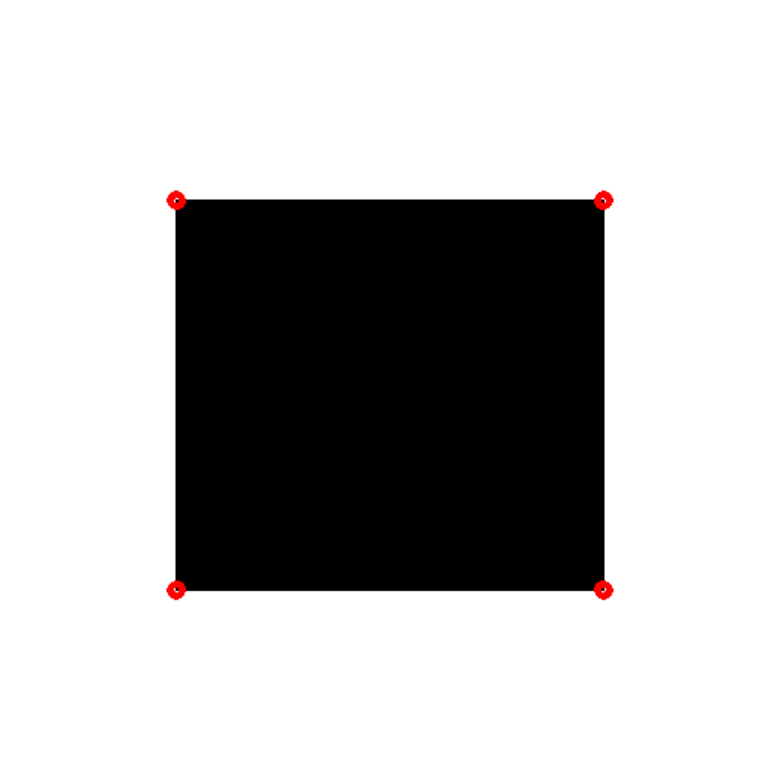
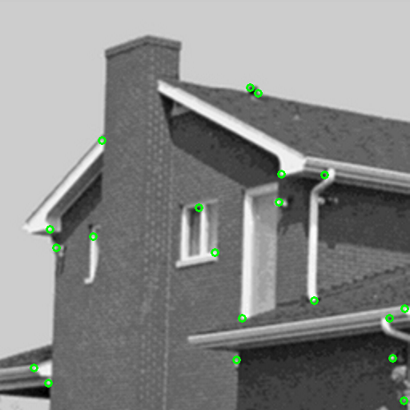

# Corner Detection

- Feature in images
  - Matching points between frames of an environment
    - Relate images to each other and extract information
  - Features are uniquely recognizable

- Types of features in images
  - Edges
  - Corners (interest **points**)
  - Blobs (**regions** of interest)

- Corner is an intersection of two edges
  - Point in which the directions of the two edges change
  - Gradients have a high variation

## How to find Corners in Images

- Determine Cornerness values for each pixel
  - Produces a Cornerness map

- Non-maxima suppression
  - Multiple response
  - Compare to local neighbours

- Threshold the Cornerness map
  - To get the most significant corners

## Harris Corner Detector

- Variation of intensity

$$
E(u, v) = \sum_{x,y}w(x, y)[I(x+u,y+v)-I(x, y)]^2
$$

- Using Taylor expansion, rearranging and on matrix form
- Calculate a score of the probability that it is a corner

## Shi-Tomasi Corner Detection

- Uses eigenvalues to detect corners and same approach as Harris Corner
  - Calculate the corner quality at every pixel in the image

- Non-maximum suppression
- Corners with minimal eigenvalues less than some threshold are rejected
- Remaining corners are sorted by quality in descending order
- Throws away corners where there is a better corner at a distance less than a maximum distance

```C++
cornerHarris(gray, output,
            3,            // Neighborhood size
            3,            // Aperture parameter for the Sobel operator
            0.04);        // Harris detector free parameter
```

```C++
goodFeaturesToTrack(gray, corners,
                   100,           // Max corners to detector
                   0.01,          // Minimal quality of corners
                   10,            // Minimum Euclidean distance between the returned corners
                   Mat(),         // Optional region of interest
                   3,             // Size of an average block for computing a derivative covariation matrix over each pixel neighbothood
                   false,         // Use harri Detector of cornerMinEigenVal - Like when you create your own
                   0.04);         // Free parameter for the Harris detector
```

## Corner Detection in Sub-pixels

- A way to find more exact corner positions by using sub-pixels
  - Normally it is integer pixels

```C++
#include<opencv2/opencv.hpp>
#include<iostream>

using namespace std;
using namespace cv;

void harrisCornerDetector() {
	Mat img, gray;
	Mat output, output_norm, output_norm_scaled;

	img = imread("../data/blackwhite.bmp", IMREAD_COLOR);
	if (img.empty()) {
		return;
	}
	imshow("Original img", img);
	cvtColor(img, gray, COLOR_BGR2GRAY);

	// Detecting corners using the cornerHarris built in function
	output = Mat::zeros(img.size(), CV_32FC1);
	cornerHarris(gray, output,
		3,            // Neighborhood size
		3,            // Aperture parameter for the Sobel operator
		0.04);        // Harris detector free parameter

	// Normalizing - Convert corner values to integer so they can be drawn
	normalize(output, output_norm, 0, 255, NORM_MINMAX, CV_32FC1, Mat());
	convertScaleAbs(output_norm, output_norm_scaled);

	// Drawing a circle around corners
	for (int j = 0; j < output_norm.rows; j++) {
		for (int i = 0; i < output_norm.cols; i++) {
			if ((int)output_norm.at<float>(j, i) > 100) {
				circle(img, Point(i, j), 4, Scalar(0, 0, 255), 2, 8, 0); // i和j是反的
			}
		}
	}

	resize(img, img, Size(), 1.5, 1.5);
	imshow("output harris", img);
	waitKey(0);
}

void shiTomasiCornerDetector() {
	Mat img, gray;
	Mat output, output_norm, output_norm_scaled;

	img = imread("../data/house.tif", IMREAD_COLOR);
	imshow("Original img", img);
	cvtColor(img, gray, COLOR_BGR2GRAY);

	vector<Point2f> corners;
	goodFeaturesToTrack(gray, corners,
		20,           // Max corners to detector
		0.01,          // Minimal quality of corners
		10,            // Minimum Euclidean distance between the returned corners
		Mat(),         // Optional region of interest
		3,             // Size of an average block for computing a derivative covariation matrix over each pixel neighbothood
		false,         // Use harri Detector of cornerMinEigenVal - Like when you create your own
		0.04);         // Free parameter for the Harris detector

	// Drawing a circle around corners
	for (size_t i = 0; i < corners.size(); i++) {
		circle(img, corners[i], 4, Scalar(0, 255, 0), 2, 8, 0);
	}

	imshow("si", img);
	waitKey(0);
}

int main() {
	harrisCornerDetector();
	shiTomasiCornerDetector();
	return 0;
}
```



