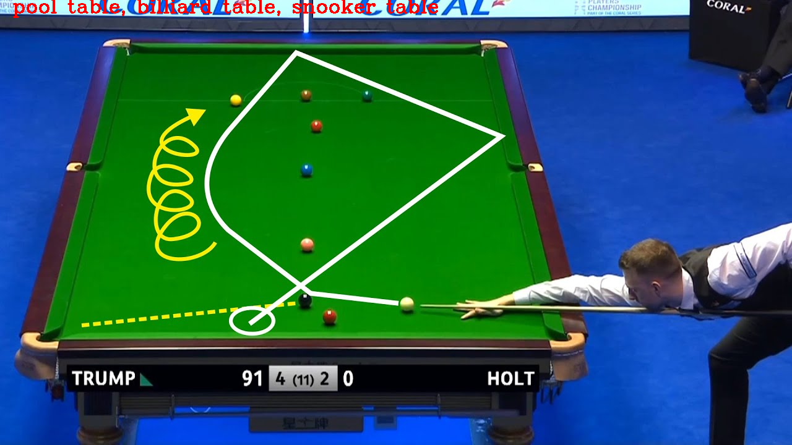

# DNN

```python
import cv2
import time
import numpy as np

with open("./models/object_detection_classes_coco.txt", 'r') as f:
    class_names = f.read().split('\n')
print(class_names)

# Get a different colors for each of the classes
colors = np.random.uniform(0, 255, size=(len(class_names), 3))

# Load the DNN model
model = cv2.dnn.readNet(model='./models/frozen_inference_graph.pb',
                        config='./models/ssd_mobilenet_v2_coco_2018_03_29.pbtxt.txt',
                        framework='TensorFlow')
# Set backend and target
model.setPreferableBackend(cv2.dnn.DNN_BACKEND_CUDA)
model.setPreferableTarget(cv2.dnn.DNN_TARGET_CUDA)
min_confidence_score = 0.4
cap = cv2.VideoCapture(0)
while cap.isOpened():
    success, img = cap.read()
    imgHeight, imgWidth, channels = img.shape
    # Create blob from image
    blob = cv2.dnn.blobFromImage(img, size=(300, 300), mean=(104, 117, 123), swapRB=True)

    start = time.time()

    # Set input to the model
    model.setInput(blob)

    # Make forward pass in model
    output = model.forward()

    end = time.time()
    fps = 1 / (end - start)
    # Run over each of the detections
    for detection in output[0, 0, :, :]:
        confidence = detection[2]
        if confidence > min_confidence_score:
            class_id = detection[1]
            class_name = class_names[int(class_id) - 1]
            color = colors(int(class_id))

            bboxX = detection[3] * imgWidth
            bboxY = detection[4] * imgHeight
            bboxWidth = detection[5] * imgWidth
            bboxHeight = detection[6] * imgHeight

            cv2.rectangle(img, (int(bboxX), int(bboxY)), (int(bboxWidth), int(bboxHeight)), thickness=2, color=color)
            cv2.putText(img, class_name, (int(bboxX), int(bboxY - 5)), cv2.FONT_HERSHEY_SIMPLEX, 1, color, 2)

    # Show FPS
    cv2.putText(img, f"{fps:.2f} FPS", (20, 30), cv2.FONT_HERSHEY_SIMPLEX, 1, (0, 255, 0), 2)
    cv2.imshow("image", img)
    if cv2.waitKey(10) & 0xFF == ord('q'):
        break
cap.release()
cv2.destroyAllWindows()
```

## Using GoogleNet

```C++
#include<iostream>
#include<fstream>
#include<opencv2/opencv.hpp>
#include<opencv2/dnn.hpp>

using namespace std;
using namespace cv;
using namespace cv::dnn;

String model_file = "../data/bvlc_googlenet.caffemodel";
String model_text = "../data/bvlc_googlenet.prototxt";
String label_file = "../data/synset_words.txt";

vector<String> readLabels() {
	vector<String> classNames;
	ifstream fp(label_file);
	if (!fp.is_open()) {
		cout << "Error when open file synset_words.txt" << endl;
		exit(-1);
	}
	string name;
	while (!fp.eof()) {
		getline(fp, name);
		if (name.length()) {
			classNames.push_back(name.substr(name.find(' ')+1));
		}
	}
	fp.close();
	return classNames;
}

int main() {
	Mat img = imread("../data/snooker.jpg");
	//imshow("orignial image", img);
	vector<String> labels = readLabels();
	Net net = readNetFromCaffe(model_text, model_file);
	if (net.empty()) {
		cout << "Error when read Model" << endl;
	}
	Mat inputBlob = blobFromImage(img, 1.0, Size(224, 224), Scalar(104, 117, 123));
	Mat prob;
    
    // why needed to do 10 for loop?
    
    // If the image is transformed differently
    // the average result is more accurate through 10 cycles
	for (int i = 0; i < 10; i++) {
		net.setInput(inputBlob, "data");
		prob = net.forward("prob");
	}
    // The following seems can get the same results.
    //net.setInput(inputBlob, "data");
	//prob = net.forward("prob");
    
	Mat probMat = prob.reshape(1, 1);
	Point classNumber;
	double classProb;
	minMaxLoc(probMat, NULL, &classProb, NULL, &classNumber);
	int classidx = classNumber.x;
	printf("current image classification: %s, possible: %.2f", labels.at(classidx).c_str(), classProb);
	putText(img, labels.at(classidx), Point(20, 20), FONT_HERSHEY_COMPLEX, 1.0, Scalar(0, 0, 255), 2, 8);
	imshow("Image Classification", img);
	imwrite("dnn_GoogleNet.png", img);
	waitKey(0);
	return 0;
}
```



```C++
#include<iostream>
#include<fstream>
#include<opencv2/opencv.hpp>
#include<opencv2/dnn.hpp>

using namespace std;
using namespace cv;
using namespace cv::dnn;

String model_file = "../data/VGG_VOC0712_SSD_300x300_iter_120000.caffemodel";
String model_text = "../data/deploy.prototxt";
String label_file = "../data/labelmap_det.txt";

const size_t width = 300;
const size_t height = 300;

vector<String> readLabels() {
	vector<String> classNames;
	ifstream fp(label_file);
	if (!fp.is_open()) {
		cout << "Error when open file labelmap_det.txt" << endl;
		exit(-1);
	}
	string name;
	while (!fp.eof()) {
		getline(fp, name);
		if (name.length() && (name.find("display_name:") == 0)) {
			string temp = name.substr(15);
			temp.replace(temp.end() - 1, temp.end(), "");
			classNames.push_back(temp);
		}
	}
	fp.close();
	return classNames;
}

const int meanValues[3] = { 104, 117, 123 };
static Mat getMean(const size_t& w, const size_t& h) {
	Mat mean;
	vector<Mat> channels;
	for (int i = 0; i < 3; i++) {
		Mat channel(h, w, CV_32F, Scalar(meanValues[i]));
		channels.push_back(channel);
	}
	merge(channels, mean);
	return mean;
}

static Mat preprocess(const Mat& frame) {
	Mat preprocesed;
	frame.convertTo(preprocesed, CV_32F);
	resize(preprocesed, preprocesed, Size(width, height)); // 300x300 image
	Mat mean = getMean(width, height);
	subtract(preprocesed, mean, preprocesed);
	return preprocesed;
}

int main() {
	Mat img = imread("../data/woman_darkhair.tif");
	//imshow("orignial image", img);
	vector<String> labels = readLabels();
	Net net = readNetFromCaffe(model_text, model_file);
	if (net.empty()) {
		cout << "Error when read Model" << endl;
	}
	//Mat input_image = preprocess(img);
	Mat inputBlob = blobFromImage(img, 1.0, Size(300, 300), Scalar(104, 117, 123));
	Mat detection;

	net.setInput(inputBlob, "data");
	detection = net.forward("detection_out");
	Mat detectionMat(detection.size[2], detection.size[3], CV_32F, detection.ptr<float>());
	float confidence_threshold = 0.8;
	for (int i = 0; i < detectionMat.rows; i++) {
		float confidence = detectionMat.at<float>(i, 2);
		if (confidence > confidence_threshold) {
			size_t objIndex = (size_t)(detectionMat.at<float>(i, 1));
			float tl_x = detectionMat.at<float>(i, 3) * img.cols;
			float tl_y = detectionMat.at<float>(i, 4) * img.rows;
			float br_x = detectionMat.at<float>(i, 5) * img.cols;
			float br_y = detectionMat.at<float>(i, 6) * img.rows;

			Rect object_box((int)tl_x, (int)tl_y, (int)(br_x - tl_x), (int)(br_y - tl_y));
			rectangle(img, object_box, Scalar(0, 255, 0), 2, 8, 0);
			putText(img, labels[objIndex].c_str(), Point(tl_x + 10, tl_y + 10), FONT_HERSHEY_SIMPLEX, 1.0, Scalar(0, 255, 0));
		}
	}
	imshow("Image Classification", img);
	waitKey(0);
	return 0;
}
```

