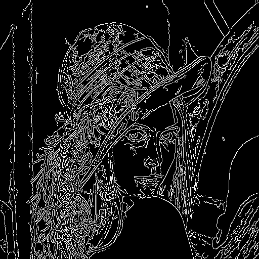

# Edge Detection

What Edges are?

- Segment objects and information in images
- Edges is the analysis of discontinuities in images

Edge Detection

- Where brightness changes abruptly

- Changes can be found by using derivatives
- Edges have gradients and orientation
  - They are found by applying convolution masks in both x and y direction

- Edge Profiles
  - Step
  - Real
  - Noisy

## First Derivative

- Rate of change in two directions
- Detecting edges can be performed by locating pixel locations where the gradient is higher than its neighbors
  - Higher than some threshold

- Peak of jump when we differentiate the image intensity function

## Convolution

- Convolution in images
  - Applying a filter/kernel on an image

- Used in edge detectors
  - Apply conv mask in x and y direction

## Roberts

- Good for binary images
- Very sensitive to noise in the image

## Sobel

- Discrete differentiation operator
- It computes an approximation of the gradient of an image intensity function
- Combines Gaussian smoothing and differentiation
- Vertical and Horizontal changes

## Thresholding

## Second Derivative

- Laplacian of Gaussian
- Canny

**What is the differences between the detectors and which one to use?**

### Laplace Operator

- Second derivative is zero
  - Edges in an images

- Laplacian operator to take the derivative in both dimensions
- Laplacian uses Sobel internally

$$
Laplace(f) = \frac{\partial^2f}{\partial x^2} + \frac{\partial^2f}{\partial y^2}
$$

### Canny

- Known as the optimal edge detector
- The Canny Algorithm computes both
  - Orientation, location and gradient

- Steps
  - Filter out any noise with Gaussian filter
  - Find the intensity gradient of the image, method similar to Sobel
  - Non-maximum suppression is applied. Removes pixels that are not considered to be part of an edge
  - Hysteresis. Using thresholds to filter pixels.

If a pixel gradient is higher than the *upper* thresholds, the pixel is accepted as an edge

If a pixel gradient is below the *lower* threshold, then it is rejected

If the pixel gradient is between the two thresholds, then it will be accepted only if it is connected to a pixel that is above the *upper* threshold

Canny recommended a *upper:lower* ratio between 2:1 and 3:1.

```C++
#include<iostream>
#include<vector>

#include<opencv2/core.hpp>
#include<opencv2/highgui.hpp>
#include<opencv2/imgproc.hpp>

using namespace std;
using namespace cv;

Mat img, gray, blurred, edge;

// Laplacian Operator Variables
int kernel_size = 3;
int ddepth = CV_16S;

// Canny Edge Detection Variables
int lowerThreshold = 0;
int max_lowThreshold = 100;

void laplacianDetection() {
	GaussianBlur(gray, blurred, Size(3, 3), // smoothing window width and height in pixels
		3); // how much the image will be blurred
	Laplacian(blurred, edge,
		ddepth, // depth of the destination image
		kernel_size); // Size of the kernel
	// convert back to CV_8U
	convertScaleAbs(edge, edge);
}

void CannyThreshold(int, void*) {
	GaussianBlur(gray, blurred, Size(3, 3), // smoothing window width and height in pixels
		3); // how much the image will be blurred
	Canny(blurred, edge, lowerThreshold, 50);
	imshow("Edge Detection", edge);
}

int main() {
	img = imread("../data/lena.png");
	if (img.empty()) {
		return 1;
	}

	cvtColor(img, gray, COLOR_BGR2GRAY);
	namedWindow("Original", WINDOW_AUTOSIZE);
	namedWindow("Gray", WINDOW_AUTOSIZE);
	namedWindow("Blurred", WINDOW_AUTOSIZE);
	namedWindow("Edge Detection", WINDOW_AUTOSIZE);

	// Canny Edge Detector
	createTrackbar("Min Threshold:", "Edge Detection", &lowerThreshold, max_lowThreshold, CannyThreshold);
	CannyThreshold(0, 0);

	// Laplacian Edge Detector
	// laplacianDetection();

	imshow("Original", img);
	imshow("Gray", gray);
	imshow("Blurred", blurred);
	// imshow("Edge Detection", edge);
	imwrite("canny.png", edge);

	waitKey(0);
	return 0;
}
```

Canny Detection



Laplacian Detection

